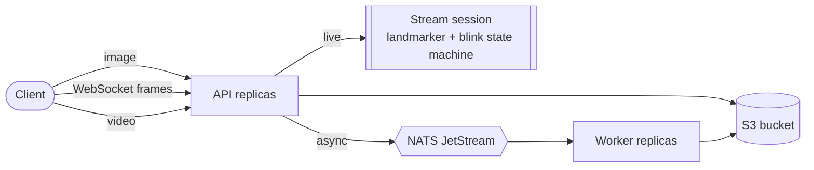

# Eye Blink Detection Service

[](https://github.com/chan4kum/opencv-eye-blink-detection/actions/workflows/ci.yml)
[](https://github.com/chan4kum/opencv-eye-blink-detection/actions/workflows/codeql.yml)
[](LICENSE)


A production-grade, horizontally scalable blink-detection service. It started as a 40-line OpenCV Haar-cascade webcam script and was
rebuilt as a real service: a modern landmark model, a deterministic blink state machine, **live detection over a WebSocket**, **asynchronous
video analysis on a distributed queue**, observability, a Helm chart and CI/CD.

* **Model:** [MediaPipe Face Landmarker](https://ai.google.dev/edge/mediapipe/solutions/vision/face_landmarker) (Apache-2.0, 3.7 MB): 478 landmarks and eye-blink blendshapes, about 10 ms per frame on one CPU thread.
* **Three ways in:** `POST /v1/eye-state` (one image), `WS /v1/stream` (live camera frames, blink events as they happen), `POST /v1/jobs` (recorded video, processed by workers).
* **Correct by construction:** blink detection is a pure, exhaustively tested state machine with hysteresis; long closures are reported separately and never counted as blinks; unobserved closures are discarded rather than guessed.
* **Distributed and cloud-agnostic:** stateless API + workers over **NATS JetStream**, videos in any **S3-compatible** store, Docker/Kubernetes, Prometheus/Grafana, OpenTelemetry.
* **Secure by default:** hashed API keys, hardened video ingestion, non-root read-only container, network policies, signed images.



Details: [docs/ARCHITECTURE.md](docs/ARCHITECTURE.md). **Read [docs/MODEL_CARD.md](docs/MODEL_CARD.md) before relying on this for anything consequential.**

## Quick start

```bash
# Full local stack: API, 2 workers, NATS, S3 (SeaweedFS), Prometheus, Grafana, Jaeger
docker compose --profile observability up -d --build --wait

# 1. Is this person's eyes open? (one image)
curl -s -X POST localhost:8000/v1/eye-state -H 'Content-Type: image/jpeg' --data-binary @tests/data/astronaut.jpg | jq

# 2. Count blinks in a recorded video (asynchronous)
ID=$(curl -s -X POST localhost:8000/v1/jobs -H 'Content-Type: video/mp4' --data-binary @tests/data/blinks_synthetic.mp4 | jq -r .job_id)
curl -s localhost:8000/v1/jobs/$ID | jq

# 3. Live: send frames, receive blink events (see "Live stream" below)
```

Note: the bundled `*_synthetic.mp4` fixtures are *synthetic* eyes; to see blinks in them use the landmark-geometry signal:
`EB_SIGNAL=ear docker compose up ...` (explained in the [model card](docs/MODEL_CARD.md)). Real footage works with the default.

### Live stream

```python
import asyncio, json, cv2, websockets


async def main():
    cap = cv2.VideoCapture(0)
    async with websockets.connect(
        "ws://localhost:8000/v1/stream", additional_headers={"Authorization": "Bearer <key>"}
    ) as ws:

        async def reader():
            async for raw in ws:
                m = json.loads(raw)
                if m["type"] == "blink":
                    print(f"blink #{m['blinks']}  {m['duration_ms']:.0f} ms")

        task = asyncio.create_task(reader())
        while True:
            ok, frame = cap.read()
            _, jpeg = cv2.imencode(".jpg", frame)
            await ws.send(jpeg.tobytes())  # binary message = one frame
            await asyncio.sleep(1 / 30)


asyncio.run(main())
```

| Server -> client message | Fields |
|---|---|
| `frame` (one per analysed frame) | `t_ms`, `face_found`, `closure` (0 open .. 1 closed), `blinks` (running count), `server_ms` (receipt to result) |
| `blink` / `long_closure` | `start_ms`, `end_ms`, `duration_ms`, `blinks` |
| `error` | `code`, `detail` (bad frame; the session continues) |

Browsers cannot set headers: use `new WebSocket(url, ["bearer", "<key>"])`. Close codes: `1008` bad credentials (refused at handshake), `1013` at capacity
(retry later), `1009` frame too large, `1000` idle timeout or maximum duration.

### Library / CLI (no servers)

```bash
uv sync
uv run eye-blink analyze clip.mp4          # blink count, rate, events as JSON
uv run eye-blink eye-state photo.jpg
uv run eye-blink webcam                    # live counter (needs GUI OpenCV, see below)
```

> MediaPipe's macOS build can abort in restricted sandboxes (Metal service unavailable). Use `make test-linux` / Docker there.
> The webcam demo needs GUI OpenCV: `uv pip uninstall opencv-python-headless && uv pip install opencv-python`.

## API

| Endpoint | Description |
|---|---|
| `POST /v1/eye-state` | Body = raw image. Returns `face_found`, `closure`, `eyes_closed`, per-eye blendshape scores and EAR. |
| `POST /v1/jobs` | Body = raw video (MP4/MOV, WebM/Matroska, AVI; detected from the bytes). `202` with `job_id`. |
| `GET /v1/jobs/{id}` | `queued` / `processing` / `succeeded` (with `result`) / `failed` (with `error`). Only the submitting key can read it. |
| `WS /v1/stream` | Live blink detection (above). |
| `GET /v1/model`, `/healthz`, `/readyz`, `/metrics` | Model metadata; liveness; readiness (model, NATS, object storage); Prometheus. |

Errors are [RFC 9457](https://www.rfc-editor.org/rfc/rfc9457) `application/problem+json` with a `request_id`.
Auth: `Authorization: Bearer <key>`; generate with `eye-blink keygen` (only the SHA-256 digest is configured).

<details><summary>Example video result</summary>

```json
{
  "video": {"width": 512, "height": 512, "fps": 30.0, "duration_s": 10.0, "frames_decoded": 300, "frames_analyzed": 300},
  "face_found_ratio": 1.0,
  "blink_count": 4, "long_closure_count": 0, "discarded_closures": 0,
  "blinks_per_minute": 24.0,
  "events": [{"kind": "blink", "start_ms": 2100.0, "end_ms": 2266.0, "duration_ms": 166.0, "peak_closure": 1.0}],
  "processing_ms": 2153.9,
  "model": {"name": "mediapipe-face-landmarker-v2", "sha256": "64184e22...", "signal": "ear"}
}
```
</details>

## Configuration

Environment variables prefixed `EB_`, validated at start-up (the process refuses to start on invalid configuration, including inconsistent
blink thresholds). The important ones:

| Variable | Default | Purpose |
|---|---|---|
| `EB_ENVIRONMENT` | `dev` | `prod` requires `EB_API_KEY_HASHES` (or an explicit `EB_AUTH_DISABLED=true`) |
| `EB_SIGNAL` | `blendshape` | `blendshape`, `ear` or `max` (see the [architecture](docs/ARCHITECTURE.md)) |
| `EB_BLINK_CLOSE_THRESHOLD` / `EB_BLINK_OPEN_THRESHOLD` | `0.5` / `0.3` | Hysteresis thresholds. **Not validated on real blink data**: tune (model card) |
| `EB_BLINK_MIN_DURATION_MS` / `EB_BLINK_MAX_DURATION_MS` | `50` / `700` | Shorter is discarded; longer is a *long closure* |
| `EB_MAX_VIDEO_BYTES` / `_SECONDS` / `_PIXELS` / `_FRAMES` | 50 MiB / 120 s / 1080p / 7200 | Video limits, enforced on decoded frames too |
| `EB_STREAM_MAX_SESSIONS` / `_MAX_FPS` / `_IDLE_TIMEOUT_S` | `16` / `30` / `30` | Live-stream limits per replica |
| `EB_ASYNC_ENABLED`, `EB_NATS_URL`, `EB_S3_*` | see `config.py` | Async pipeline backing services |
| `OTEL_EXPORTER_OTLP_ENDPOINT` | *(unset)* | Enables tracing |

Full reference with types and bounds: [`src/eye_blink/config.py`](src/eye_blink/config.py).

## Deploy

* **Docker Compose:** above. **Kubernetes:** the Helm chart in [`deploy/helm/eye-blink`](deploy/helm/eye-blink) (HPA or KEDA, PDBs, NetworkPolicies, ServiceMonitor, PrometheusRule, Grafana dashboard).
* **Guide, production checklist (including WebSocket ingress timeouts) and AWS mapping:** [docs/DEPLOYMENT.md](docs/DEPLOYMENT.md).

## Measured behaviour

Measured on the code in this repository with the **real model** (Apple M4 Pro, Docker Desktop, one API container, 512x512 frames; reproduce with `make bench`):

| Workload | Result |
|---|---|
| `POST /v1/eye-state`, 1 client | 84 req/s, p50 11.6 ms, p95 13.3 ms |
| `POST /v1/eye-state`, 4 / 16 clients | 272 / 363 req/s, p50 13.9 / 40.2 ms, p95 19.7 / 73.4 ms, 0 errors |
| Live stream, 1 / 4 / 8 / 16 concurrent sessions at 30 fps | server latency p50 8.8 / 8.3 / 8.6 / 11.6 ms; worst-session p95 9.8 / 9.8 / 14.6 / 43.9 ms; 97.5 to 100% of frames answered; 745 MiB at 16 sessions |
| 17th live session (cap 16) | closed with code `1013` and reason "server at capacity" |
| Video job, 10 s / 300 frames | 2.15 s end to end in a worker (about 140 frames/s); 2.39 s on Kubernetes |
| Image size | 216 MB (non-root, read-only rootfs) |

Numbers are for this hardware and these synthetic frames; benchmark your own workload before capacity planning.

## Verification status

| Area | How it was verified | Result |
|---|---|---|
| Blink state machine | 26 tests: 10 to 60 fps, flicker, hysteresis, long closures, lost faces, invalid input | passes |
| Pipeline vs ground truth | Synthetic videos with known blink times through the **real model**, in Linux | all 4 scheduled blinks found, none invented, long closure classified correctly (with `EB_SIGNAL=ear`) |
| Tests | Unit (fake model, runs anywhere) + real-MediaPipe tests + integration on real NATS/S3, in Linux | see the CI badge; combined coverage gate 90% |
| Container | Built, run non-root / read-only / no capabilities; real face, video job, live stream | works |
| Compose stack | 10 services healthy; Prometheus 4 targets up, 8 alert rules; Grafana dashboard; **one Jaeger trace spans API and worker** | works |
| Kubernetes (kind) | Chart install, `helm test`, auth, real-model image/video/WebSocket calls, session cap; 20 video jobs queued with workers parked, NATS restarted, workers restored | 20/20 succeeded, all with the correct blink count |
| Helm chart | `helm lint --strict`; every emitted `EB_*` variable is a real setting (test) | passes |

**Not verified (be aware):** accuracy on real people and the default blendshape thresholds (see the model card: this is the most
important gap); demographic fairness; KEDA and prometheus-operator resources render but were not applied to a cluster with those CRDs;
NetworkPolicy enforcement depends on your CNI; multi-arch image build, signing, SBOM and OCI chart push run only in the release workflow;
behaviour under sustained multi-node load; macOS execution of MediaPipe (aborts in sandboxes; Linux is the supported target).

## Development

```bash
uv sync --all-groups && uv run pre-commit install
make lint             # ruff, ruff format, mypy --strict
make test             # unit tests with the fake model (any OS)
make test-linux       # everything including real MediaPipe, in a Linux container
make up && make test-integration
```

See [CONTRIBUTING.md](CONTRIBUTING.md), [docs/RUNBOOK.md](docs/RUNBOOK.md), [SECURITY.md](SECURITY.md), [docs/adr](docs/adr).

## Layout

```
src/eye_blink/    blink (state machine), landmarker (MediaPipe), video, service, api/ (HTTP+WebSocket), worker, jobs, storage, config, CLI
tests/            fake-model unit tests, real-MediaPipe tests, integration tests, synthetic video fixtures
scripts/          make_fixture_video.py (ground-truth videos), bench.py, gen_dashboard.py
models/           vendored Face Landmarker bundle + license + provenance
deploy/           helm/, compose/, images/, prometheus/, kind/       docs/   architecture, deployment, runbook, model card, ADRs
```

## License

MIT for this repository. The bundled MediaPipe Face Landmarker model is Apache-2.0; see [models/README.md](models/README.md) and [models/LICENSE](models/LICENSE).
