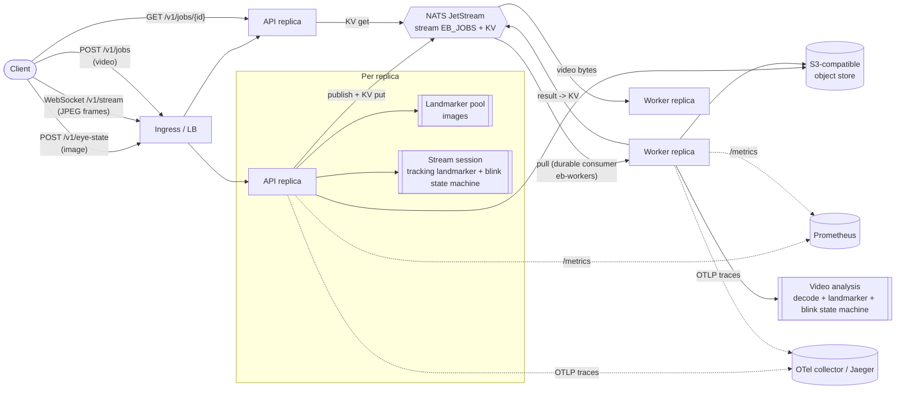

# Architecture

## Overview

Three ways to use the service:

| Path | Use when | Flow |
|---|---|---|
| **`POST /v1/eye-state`** (sync) | You have one image and want to know whether the eyes are open | Validate, decode, landmark, respond. A single image cannot contain a *blink* (that needs time). |
| **`WS /v1/stream`** (live) | A camera is feeding frames and you want blinks as they happen | One session = one tracking landmarker + one blink detector. Frames in, `frame` and `blink` events out. |
| **`POST /v1/jobs`** (async) | Recorded clips, batches, bursts | Upload to the object store, enqueue on JetStream, `202`; a worker analyses the whole clip; poll `GET /v1/jobs/{id}`. |

## From pixels to blinks

1. **Landmarks.** MediaPipe Face Landmarker (478 landmarks + 52 blendshape scores) on each frame.
2. **Closure signal** in [0, 1] per frame (`EB_SIGNAL`):
   * `blendshape` (default): mean of `eyeBlinkLeft` and `eyeBlinkRight`. Learned on real faces, robust to gaze direction and head pose.
   * `ear`: eye aspect ratio from landmark geometry, mapped linearly between calibrated open (0.30) and closed (0.10) values. Model-agnostic, but it drops when the subject looks down.
   * `max`: the larger of both. Most sensitive, most false positives.
3. **Blink state machine** (`eye_blink.blink`, pure Python, no I/O): a closure rising above `close_threshold`, then falling below `open_threshold` (hysteresis), lasting `min..max` ms is a **blink**. Longer is a **long closure** (drowsiness-relevant, never counted as a blink). A closure whose end was not observed (stream ended, or the face was lost for more than `max_face_gap_ms`) is *discarded*, not guessed.
4. **Blink rate** (video only) is blinks per minute *of face-visible time*, and `null` below 5 s of data rather than a misleading number.

## Live stream design

* **Protocol.** Client sends binary messages (one JPEG/PNG/WebP/BMP frame each). Server sends `frame` messages
  `{t_ms, face_found, closure, blinks, server_ms}` and `blink` / `long_closure` messages. Text `ping` returns `pong`.
* **Server-side clock.** Timestamps are the server's receive time. A client cannot forge or skew blink durations,
  and there is no clock synchronisation to get wrong. Keep the client cadence steady.
* **Bounded latency instead of growing queues.** A reader coroutine keeps only the *newest* unprocessed frame
  (older ones are dropped as `stale`), so if analysis falls behind, latency stays flat and you lose frames rather than time.
* **Token-bucket rate limit** per session (`EB_STREAM_MAX_FPS`, burst of `max(2, fps/5)`): tolerant of network jitter,
  strict on sustained overload. (A strict minimum frame gap dropped about a third of frames from a real 30 fps client.)
* **Backpressure and capacity.** `EB_STREAM_MAX_SESSIONS` per replica. Over the limit the socket is *accepted* then closed
  with code `1013` and a reason, so it is distinguishable from an authentication failure (which is refused at the handshake).
* **Lifecycle.** Idle timeout, maximum duration, oversized frame (`1009`), abrupt disconnects. Cleanup of the native
  landmarker is shielded from cancellation, so it cannot leak when a connection is torn down.
* **Auth.** `Authorization: Bearer <key>`, or `Sec-WebSocket-Protocol: bearer, <key>` for browsers (which cannot set headers).
  Keys are never accepted in the URL, where they would end up in access logs.

## Video ingestion (untrusted input)

Decoding attacker-controlled video with FFmpeg is the riskiest thing this service does:

1. Container allow-list from **magic bytes** (MP4/MOV, WebM/Matroska, AVI). The client's Content-Type is not trusted.
2. Header limits (resolution, duration) before any frame is decoded.
3. **Runtime limits that do not trust the header:** hard cap on decoded frames, per-frame pixel check, wall-clock budget.
4. Decoding from a private `0600` temp file that is always removed; the landmarker is always closed.
5. The worker runs non-root with a read-only root filesystem; only `/tmp` (size-limited `emptyDir`) is writable.

## Components

| Component | Responsibility | Scaling unit |
|---|---|---|
| **API** (`eye_blink.api.app`) | HTTP + WebSocket, auth, validation, image analysis, live sessions, job submission and status | Replicas behind a load balancer (HPA on CPU). Sessions do not need stickiness (a session lives on one connection). |
| **Worker** (`eye_blink.worker`) | Consume video jobs, analyse, persist results | Replicas sharing one durable JetStream consumer (KEDA on consumer lag, or CPU HPA) |
| **NATS JetStream** | Work-queue stream and KV bucket (job state) | 1 node (dev) or 3-node cluster (`replicas=3`) |
| **Object storage (S3 API)** | Holds uploaded videos for async jobs; short-lived | Managed or self-hosted |
| **Model** (MediaPipe Face Landmarker, 3.7 MB) | Landmarks + blendshapes | Baked into the image, checksum-verified on start |

API and worker are the **same image**, started with different commands. Neither holds durable state, so any API replica
can answer any `GET /v1/jobs/{id}`.

## Failure handling and delivery semantics

Identical to the sibling `face-detection` service, with one clarification that this project's tests pin down:

* **At-least-once, idempotent.** A redelivered job whose record is already terminal is acknowledged and skipped.
* **Persist before acknowledge.** The worker writes the outcome to the KV bucket *before* acking the message.
* **Permanent vs transient.** Input errors (`4xx`: invalid or over-limit video, unsupported container, missing object) fail the job
  immediately with a client-safe message. **Infrastructure errors (`5xx`: object store down, overload) are retried** with
  back-off up to `EB_JOB_MAX_DELIVER`, then failed as `failed_exhausted` (which pages). Classification is by HTTP status of the
  raised error, so a storage outage can never permanently fail a healthy job.
* **Poison messages** are terminated. **Graceful shutdown** stops pulling, finishes in-flight jobs, flushes and closes NATS.

## Data handling

* Videos and frames are processed in memory and in a temp file; uploaded videos are **deleted after processing**
  (`EB_DELETE_INPUT_AFTER_PROCESSING`, default true) with a bucket lifecycle rule as a backstop. **Live frames are never stored.**
* Results contain timestamps, durations and closure values, never pixels; they expire by TTL (`EB_JOB_TTL_S`).
* Jobs belong to the API key that created them; other keys get `404`.
* Eye state and blink rate are sensitive (they can indicate fatigue or health conditions). See [MODEL_CARD.md](MODEL_CARD.md).

## Observability

* **Metrics:** request rate/latency/errors by route template; `eb_blinks_detected_total{source,kind}`;
  `eb_frames_analyzed_total{source,face}`; `eb_video_analysis_seconds`; live-stream gauges and counters
  (`eb_stream_active_sessions`, `eb_stream_sessions_closed_total{reason}`, `eb_stream_frames_dropped_total{reason}`);
  load-shedding and job outcome metrics. A Grafana dashboard and alert rules ship in `deploy/`.
* **Tracing:** OpenTelemetry (off unless `OTEL_EXPORTER_OTLP_ENDPOINT` is set). One trace spans API `POST /v1/jobs` and the
  worker's `process_job` / `analyze_video` (context propagated through NATS headers).
* **Logs:** structured JSON with `request_id`, `trace_id`, `span_id`.

## Scaling notes

* CPU-bound. Each analysed frame is roughly 8 to 12 ms of one core (see README for measurements). Live sessions scale by adding API
  replicas; video by adding workers (KEDA on queue lag).
* Memory: about 185 MiB idle plus roughly 28 MiB per live session (each session owns a native landmarker).
* One process per container (the Prometheus registry is per process).
* MediaPipe's macOS build aborts in some sandboxes (Metal service unavailable). Development on such machines uses the Linux
  test container (`make test-linux`); production is Linux only.
